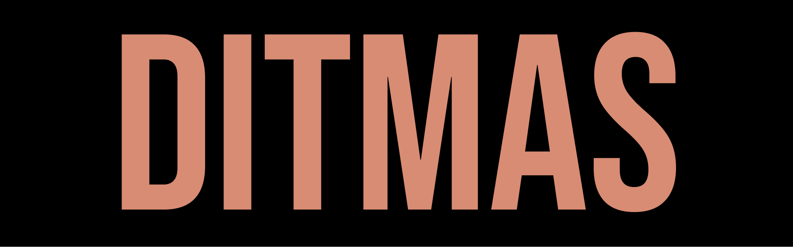

  

Ditmas is a collection of dotfiles, scripts and host configurations.

## Primer

- [`stow/`](./stow) contains [GNU Stow](https://www.gnu.org/software/stow/) packages. They may contain a mix of static configuration 
    files and executable scripts. See each package's README for more details. Packages are intended to be installed to
    the home directory (set stow's target directory to `$HOME`); see [dstow](./stow/dmutils/dstow) for a concrete
    example.
- [`hosts/`](./hosts) contains host configurations. Each host is defined by a directory named after it, which contains a `stow`
    file, listing the stow packages to be installed, and further (os specific) package manager packages. A `base` host
    exists as a default.
- [`setup/`](./setup) contains setup scripts for bootstrapping and preparing hosts. Install scripts are mostly oppinionated and
    post-installation is based upon the afforementioned host configurations.

